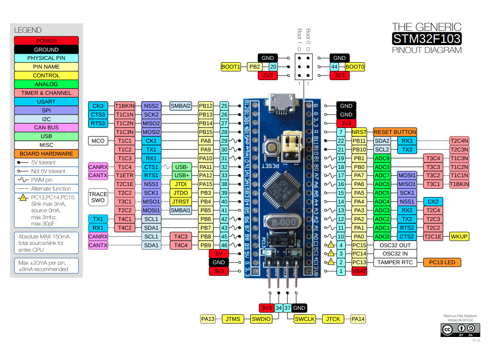

# STM32F030C8T6 Usage Examples

This repository contains code examples showcasing the usage of STM32F030C8T6, a microcontroller from the STM32 family by STMicroelectronics. The examples cover various aspects of development with this processor, including the usage of GPIO as both input and output, handling interrupts, ADC, UART, and timers.

## Repository Contents

The repository is organized as follows:

- **/gpio**: Examples demonstrating the usage of GPIO as inputs and outputs.
- **/interrupts**: Examples showcasing how to handle interrupts on the STM32F030C8T6.
- **/adc**: Examples of configuring and using the ADC (Analog-to-Digital Converter).
- **/uart**: Examples of configuring and using UART communication.
- **/timer**: Examples of configuring and utilizing timers on the STM32F030C8T6.

## Requirements

To use these examples, you will need:

- A development board or kit based on STM32F030C8T6.
- A STM32-compatible development environment such as STM32CubeIDE or Keil uVision.
- Basic knowledge of C programming language and familiarity with STM32 microcontroller.

## Contributions

Contributions to this repository are welcome! If you have additional examples, improvements, or fixes, feel free to submit a pull request.

## Additional Resources

Here are some helpful resources to learn more about STM32F030C8T6 and development with STM32:

- [STMicroelectronics - STM32 Product Page](https://www.st.com/en/microcontrollers-microprocessors/stm32-32-bit-arm-cortex-mcus.html)
- [STM32CubeIDE - Integrated Development Environment for STM32](https://www.st.com/en/development-tools/stm32cubeide.html)
- [STM32F0 Reference Manual](https://www.st.com/resource/en/reference_manual/dm00031936-stm32f0x1stm32f0x2stm32f0x8-advanced-armbased-32bit-mcus-stmicroelectronics.pdf)

## License

This repository is distributed under the [MIT License](LICENSE).

## Example Schematic

